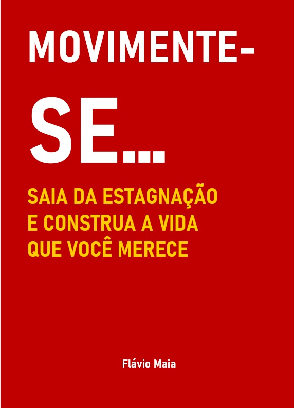

<!DOCTYPE html>
<html lang="pt-BR">
<head>
  <meta charset="UTF-8" />
  <meta name="viewport" content="width=device-width, initial-scale=1" />
  <title>MOVIMENTE-SE - Flávio Maia</title>
  
</head>
<body>

  <header>
    <h1>MOVIMENTE-SE...</h1>
    <h2>Flávio Maia</h2>
  </header>

  <!-- Imagem da capa do livro -->
  

  <section class="description">
    
<strong>MOVIMENTE-SE…</strong> é um chamado direto para quem se sente preso, parado ou desconectado dos próprios sonhos. Se em algum momento você já disse “minha vida não anda” ou “não sei por onde começar”, este livro é para você.

    
Aqui, você vai refletir sobre os ciclos de estagnação, entender como a inércia mental e emocional nos prende e, principalmente, descobrir caminhos práticos para sair desse estado.

  </section>

  <!-- Botão de compra direcionando para Hotmart -->
  <a href="https://www.hotmart.com/product-link-aqui" target="_blank" class="buy-button">Comprar por R$49,90</a>

</body>
</html>
